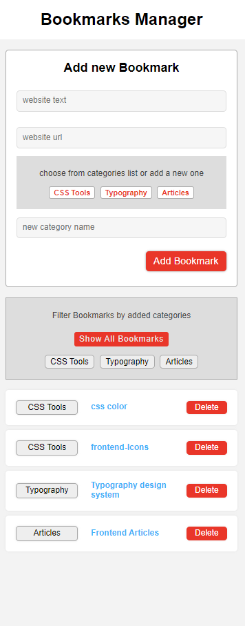
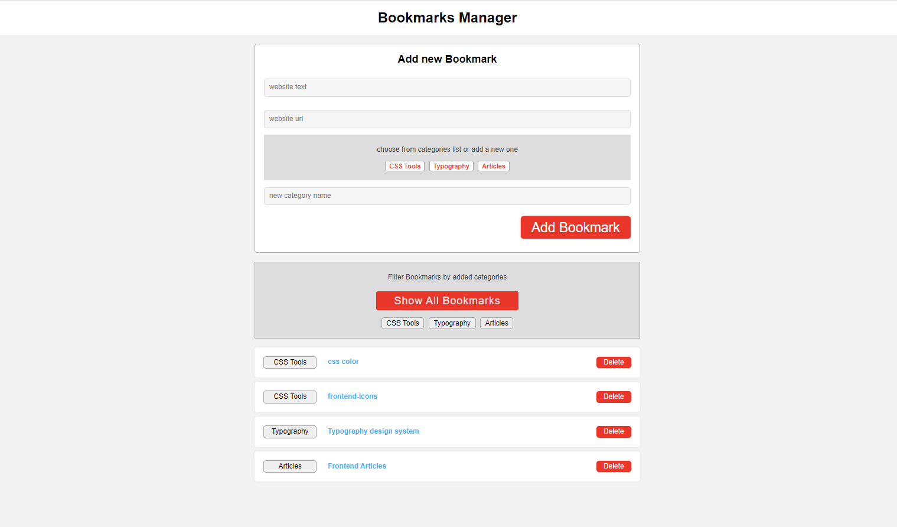

#  Bookmarks Manager

A simple bookmarks manager built with HTML, CSS, Normalize.css, and JavaScript.  
 This application allows users to add, view, sort, and delete bookmarks.   
  Bookmarks are stored in the browser's local storage.   

## Features

- **Add Bookmark**: Users can fill a form with the bookmark name, URL, and category to add a new bookmark.
- **View Bookmarks**: All bookmarks are displayed on the page.
- **Sort Bookmarks**: Users can sort bookmarks by categories by clicking the category name button.
- **Delete Bookmark**: Users can delete bookmarks.

## Technologies Used

- **HTML**: Markup language for creating the structure of the web page.
- **CSS**: Styling for the web page.
- **Normalize.css**: A CSS file that makes browsers render all elements more consistently and in line with modern standards.
- **JavaScript**: Programming language for adding interactive functionality to the web page.   

## Installation

1. Clone the repository:

   ```bash
   git clone https://github.com/yourusername/bookmarks-manager.git

2. Navigate to the project directory:   
    ```bash
    cd bookmarks-manager
3. Open index.html in your web browser to view the application.   

## Usage
1. Add a Bookmark:

    - Fill in the "Bookmark Name", "URL", and "Category" fields in the form.
    - Click the "Add Bookmark" button to save the bookmark to local storage and display it on the page.   

2. Sort Bookmarks:

    - Click on any category name button to filter and display bookmarks belonging to that category.   

3. Delete a Bookmark:

    - Click the "Delete" button next to the bookmark you want to remove.   


